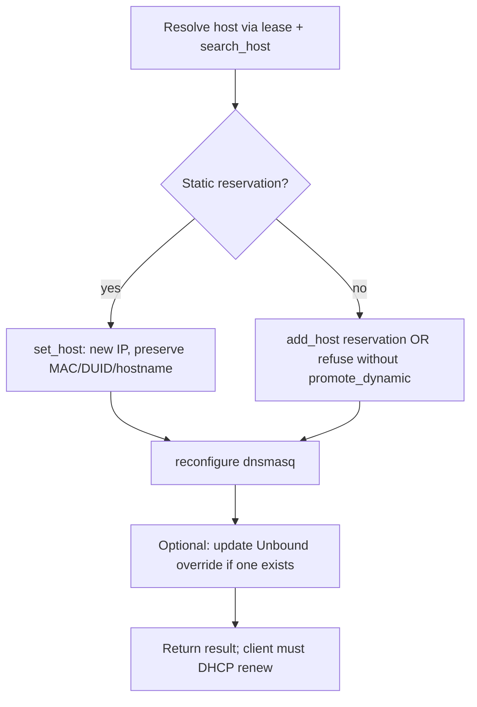

# DHCP Host Move & Subnet Defrag — Feasibility

Status: feasibility discussion + **Phase 0 spike complete** (live API validated).  
Last updated: 2026-06-11.

> **Phase 0 spike results are in [Phase 0 Spike Results](#phase-0-spike-results-2026-06-11) below.**
> Net effect on the IPv4 path: *simpler* than first assumed — a host reservation
> carries both v4 and v6 in one record keyed by MAC, so the config edit is a single
> `set_host` on one field.
>
> **IPv6 caveat (corrected after live lease inspection):** the `::N` reservation is
> MAC-keyed in *config*, but DHCPv6 *runtime* identity is the **DUID**. It works
> today only for clients doing stateful DHCPv6 whose DUID embeds the MAC (DUID-LL).
> Many wifi/IoT clients use SLAAC/privacy addressing and never take the stateful
> lease, so their `::N` reservation is inert — moving it is a config-only no-op for
> those devices. IPv6 moves are therefore **device-dependent**, not universally
> effective. See [IPv6 reality](#ipv6-reality-duid-vs-mac-stateful-vs-slaac).

## Summary

**We cannot move hosts or reshuffle subnet addresses today.** The MCP server can read DHCP leases and perform a few related operations (delete leases on ISC only, manage Unbound DNS overrides, configure per-subnet DHCP DNS). What is needed for host moves and subnet defrag is **static reservation / host configuration** APIs, which are not implemented yet.

The production firewall in use runs **dnsmasq** (leases expose `is_reserved`, interface keys like `opt2` / `opt5`). That backend should be the first implementation target.

---

## Goals

### Stretch: subnet defrag

Natural-language intent such as *"consolidate subnet 10.0.2.0"*:

- Find lowest free addresses in a subnet.
- Move higher-numbered hosts into those slots for IPv4 and IPv6.
- Keep DHCP-registered names aligned so hostnames follow the move.

### MVP: single-host move

Natural-language intent such as *"move hostx to address .2"*:

- Move `hostx` on its current subnet to `x.x.x.2` and `::2` respectively.
- Preserve reservation identity (MAC / DUID) and hostname registration.

---

## What Exists Today

| Capability | MCP tool / code | Notes |
|------------|-----------------|-------|
| List / search leases | `dhcp` | IPv4 + IPv6; strips noisy fields including **DUID** |
| Delete active lease | `dhcp_lease_delete` | **ISC only** — dnsmasq and Kea return "not supported" |
| Per-subnet DHCP DNS | `list_dhcp_subnet_dns`, `set_dhcp_subnet_dns` | dnsmasq + Kea; uses `dhcp_scope` resolution |
| Unbound DNS overrides | `dns`, `mkdns`, `rmdns`, `flush_dns` | Separate from DHCP dynamic registration |
| Backend detection | `detect_dhcp_backend()` | ISC / Kea / dnsmasq |
| Host resolution helper | `resolve_host_info()` in API client | Correlates ARP, DHCP, DNS — read-only |

### Not implemented

- List / create / update / delete **static DHCP reservations** (dnsmasq hosts, ISC static maps, Kea reservations)
- Change a host's reserved IPv4 or IPv6 address
- Subnet occupancy / lowest-free-address logic
- Coordinated move with DHCP-registered DNS names
- Subnet defrag orchestration

### Relevant code paths

- Lease tools: `opnsense_mcp/tools/dhcp.py`, `opnsense_mcp/tools/dhcp_lease_delete.py`
- Provider layer: `opnsense_mcp/utils/dhcp_provider.py`, `opnsense_mcp/utils/dhcp_providers/{isc,dnsmasq,kea}.py`
- Scope resolution: `opnsense_mcp/utils/dhcp_scope.py` (subnet CIDR, interface, range lookup)
- Subnet DNS (rollback pattern reference): `opnsense_mcp/utils/dhcp_subnet_dns.py`, `opnsense_mcp/tools/dhcp_subnet_dns.py`
- DNS overrides: `opnsense_mcp/tools/mkdns.py`, `opnsense_mcp/tools/dns.py`
- Endpoint research: `docs/research/dhcp-backend-endpoints.md`

---

## Live Environment Observations

Sample lease data from the production firewall:

### `10.0.2.0/24` (VLAN2wired / `opt2`)

Hosts such as `pi5`, `appletv-basement`, `rpi4-0`, `ds`, `hdhomerun01`, `trogdor-en8` all show `is_reserved: ['hwaddr']`. These are **static dnsmasq host entries**, not ephemeral dynamic leases. Moving them requires editing reservation config (`search_host` / `set_host`), not only deleting a lease.

### `10.0.8.0/24` (VLAN81wifi / `opt5`)

Mixed population:

- **Reserved** (examples): `printer` @ `.2`, `bose-familyroom` @ `.3`, `trogdor` @ `.80`
- **Dynamic only** (examples): `LG_Smart_Laundry2_open` @ `.7`, `trogphone` @ `.13`, many `*` hostnames

A defrag must treat reserved and dynamic clients differently unless dynamic clients are promoted to reservations first.

### IPv6

Searches for these subnets returned **no IPv6 leases** in the sample. IPv6 defrag may be reservation-only or not in active use yet. When it is, matching must use **DUID / client_id**, not MAC alone.

---

## OPNsense APIs Available (Not Yet Wrapped)

### dnsmasq (primary target)

Documented under [Dnsmasq API](https://docs.opnsense.org/development/api/core/dnsmasq.html):

| Operation | Endpoint |
|-----------|----------|
| Search hosts / reservations | `GET` / `POST` `/api/dnsmasq/settings/search_host` |
| Get host | `GET` `/api/dnsmasq/settings/get_host` |
| Add host | `POST` `/api/dnsmasq/settings/add_host` |
| Update host | `POST` `/api/dnsmasq/settings/set_host` |
| Delete host | `POST` `/api/dnsmasq/settings/del_host` |
| Search ranges (pool bounds) | `GET` / `POST` `/api/dnsmasq/settings/search_range` |
| Apply changes | `POST` `/api/dnsmasq/service/reconfigure` |

Behavior notes from OPNsense docs:

- Reservations bind MAC and/or client identifier to fixed addresses.
- Hostname plus range domain drive **dynamic DNS registration** (dhcp-fqdn).
- Setting domain on a reservation alone does not change dynamic registration; dnsmasq combines host with the domain configured on the matching DHCP range.
- Lease search exists (`/api/dnsmasq/leases/search`); **no documented lease-delete endpoint**.

### ISC DHCP (legacy)

- Static maps: `dhcpv4` / `dhcpv6` settings APIs (`search_staticmap`, etc.)
- Lease delete: `POST /api/dhcpv4/leases/del_lease/{ip}` — **already wrapped** and working

### Kea

- Subnet CRUD is partially wrapped (subnet DNS).
- Host reservation endpoints need live validation on the target OPNsense version.
- Lease delete is not documented / not wrapped.

---

## MVP: `move_dhcp_host`

### Suggested tool shape

```
move_dhcp_host(
  host | mac | hostname,     # identifier
  ipv4 | ipv4_suffix,        # full address or last-octet (e.g. 2 → .2)
  ipv6 | ipv6_suffix,        # optional; later phase
  subnet | interface,        # optional; default infer from current lease
  dry_run=true,              # strongly recommended default for first use
  promote_dynamic=false,     # create reservation if host is dynamic-only
)
```

### Workflow (dnsmasq)



### Building blocks to add

1. **Provider protocol extension** — `list_hosts`, `get_host`, `set_host`, `add_host` per backend (mirror the subnet DNS provider pattern).
2. **Lease ↔ reservation correlation** — match on MAC / `client_id`; use `is_reserved` from lease output as a hint.
3. **Scope math** — reuse `dhcp_scope` + `search_range` for subnet bounds; exclude gateway (typically `.1`).
4. **Conflict detection** — target IP must not be used by another reservation or active lease.
5. **DNS name follow-through**
   - **DHCP registration**: preserve hostname on reservation; dnsmasq updates on client renew/rebind.
   - **Static Unbound overrides**: search via `dns`; update via new `setHostOverride` wrapper or `mkdns` / `rmdns` pair.
6. **Apply + rollback** — snapshot before change, restore on failure (same pattern as `set_dhcp_subnet_dns`).

### MVP limitations

| Topic | Limitation |
|-------|------------|
| Remote DHCP renew | Firewall can change reservation; **client must renew** (reboot, `dhclient`, etc.) |
| dnsmasq lease delete | Not available via API; stale lease may linger until expiry or client renews |
| Dynamic-only hosts | Reliable moves require creating a reservation first |
| IPv6 | DUID required; `dhcp` tool currently **strips DUID** from output |
| Unbound `set` | No MCP wrapper for `setHostOverride` today (only add/delete) |

---

## Stretch: Subnet Defrag

Orchestration layer on top of single-host move.

### Algorithm (high level)

1. Resolve subnet → interface → DHCP range(s).
2. Build occupancy set: reservations + active leases + reserved gateway/network addresses.
3. Select move candidates per policy (all reserved hosts? only addresses above a threshold? skip `*` hostnames?).
4. Assign lowest free slots (`.2`, `.3`, … skipping in-use addresses).
5. Execute moves in **collision-safe order**:
   - move into temporary staging addresses first, then into final slots; or
   - process from highest current IP downward into lowest free slots.
6. Return dry-run plan before apply.

### Extra complexity vs MVP

| Topic | Challenge |
|-------|-----------|
| Mixed static / dynamic | Many clients are dynamic-only; defrag may skip them or auto-promote |
| Name records | DHCP FQDN vs manual Unbound overrides; `*` hostnames do not follow meaningfully |
| IPv4 / IPv6 pairing | Stable identity (MAC ↔ DUID) across address families |
| Live traffic | Moving active devices causes brief connectivity loss |
| Agent UX | Natural language should map to deterministic dry-run + explicit user confirmation |

### Suggested tools

| Tool | Purpose |
|------|---------|
| `plan_subnet_defrag` | Read-only: proposed moves, conflicts, skipped hosts |
| `apply_subnet_defrag` | Execute a previously generated plan (with rollback) |

---

## Recommended Phases

### Phase 0 — API spike (1–2 days)

Against live OPNsense:

- Capture `search_host` / `get_host` / `set_host` request and response payloads.
- Document fields for IPv4, IPv6, DUID / `client_id`, hostname, domain, tags.
- Confirm `reconfigure` behavior and DNS registration side effects.

### Phase 1 — MVP (`move_dhcp_host`)

- dnsmasq only
- `dry_run` default
- Single host, IPv4 suffix or full address
- Conflict detection
- Optional Unbound override update

### Phase 2 — IPv6 + identity

- Stop stripping DUID in `dhcp` lease output (or expose via separate field)
- DUID-based reservation moves
- Paired IPv4 + IPv6 move for the same host

### Phase 3 — Subnet defrag

- `plan_subnet_defrag` + `apply_subnet_defrag`
- Staging strategy for collision-free multi-move
- Kea / ISC backends if required

### Phase 4 — Agent ergonomics

- Thin mapping so *"consolidate 10.0.2.0"* invokes plan → confirm → apply

---

## Phase 0 Spike Results (2026-06-11)

Validated live against the production firewall (`fw.freeblizz.com`, dnsmasq backend)
via the OPNsense REST API. Read operations plus a full throwaway CRUD round-trip
were exercised. **`reconfigure` was deliberately NOT called**, so the test entry
never reached the running dnsmasq config; it was created and deleted purely in the
staged config and cleanup was confirmed (`search_host` for the test name returns 0 rows).

### Key finding: one host record holds both IPv4 and IPv6

A reservation's `ip` field is a **comma-separated v4,v6 pair** in a single record:

```json
{
  "uuid": "6c20...bdab", "host": "printer", "domain": "", "local": "0",
  "ip": "10.0.8.2,::2", "cnames": "", "client_id": "",
  "hwaddr": "c8:a3:e8:dc:1b:b9", "lease_time": "", "ignore": "0",
  "set_tag": "", "descr": "VLAN81wifi", "comments": "", "aliases": ""
}
```

Consequences:

- A move that changes both families is **one `set_host` call editing one field** in the *config* — inherently atomic, no v4/v6 pairing orchestration needed at the config layer.
- The reservation's IPv6 is a `::N` suffix; dnsmasq expands it to `<vlan-prefix>::N`. In config it is bound to the `hwaddr` (MAC), `client_id` empty on all 57 hosts.
- **But config-bound-to-MAC ≠ runtime-matched-by-MAC.** See [IPv6 reality](#ipv6-reality-duid-vs-mac-stateful-vs-slaac) — runtime DHCPv6 matching is by DUID, and effectiveness is device-dependent. Whether the `dhcp` tool's DUID stripping matters depends on the move strategy chosen (config-suffix vs DUID-reservation).

### IPv6 reality: DUID vs MAC, stateful vs SLAAC

Inspecting the live lease table (118 leases: 81 v4, 37 v6) corrected the initial assumption:

- v6 leases are **stateful DHCPv6** on the delegated GUA prefix, keyed by
  `client_id` = **DUID** (e.g. `00:03:00:01:e4:d1:24:52:91:ff`, a DUID-LL embedding
  the MAC). The `hwaddr` column is dnsmasq *deriving* MAC from the DUID-LL.
- **The `::N` suffix reservation works — for stateful clients.** Proof on VLAN2wired:
  `pi5` 10.0.2.2 → `…b502::2`, `appletv-basement` 10.0.2.6 → `…b502::6`,
  `ds` 10.0.2.19 → `…b502::19`. The v6 suffix tracks the v4 octet exactly.
- **It is inert for SLAAC/privacy clients.** The VLAN81wifi reserved hosts `printer`
  (`::2`) and `bose-familyroom` (`::3`) have **only v4 leases** — no v6 lease at all.
  Wifi/IoT devices that don't take a stateful DHCPv6 lease ignore the reservation.
- MAC-keyed v6 reservations resolve whenever the client's DUID **contains the
  link-layer address** — both **DUID-LL** (type 3) and **DUID-LLT** (type 1, observed
  on the Apple TVs and macOS) embed the MAC, so dnsmasq matches both. Only a
  **DUID-UUID** (type 4) client would fail a MAC-only reservation and need a
  `client_id`-based reservation. None were observed in this environment.

#### Live move test — empirical proof (2026-06-11)

Ran an actual create-reservation + renew cycle on a user-controlled MacBook Pro
(`50:f2:65:e9:7c:b0`, dynamic at `10.0.8.133`), targeting `10.0.8.96,::96`:

| Family | Before | After reservation + DHCP renew | Verdict |
|--------|--------|-------------------------------|---------|
| IPv4 | `10.0.8.133` (dynamic) | **`10.0.8.96`**, `is_reserved=['hwaddr']` | reservation honored |
| IPv6 | `…b508::ce3a` (SLAAC privacy) | **still `…b508::ce3a`** | reservation **inert** |

The v6 lease flipped to `is_reserved=['hwaddr']` (dnsmasq knows the reservation
exists) yet the device stayed on its SLAAC **privacy** address — macOS never sent a
stateful DHCPv6 address request, so `::96` was never assigned. This confirms on real
hardware: **IPv4 reservation moves are reliable; IPv6 `::N` moves are a config-only
no-op for SLAAC/privacy clients (macOS), effective only for stateful-DHCPv6 devices
(Apple TV, Synology observed).** Also validated live: `add_host` promotes a
dynamic host to a reservation, and `reconfigure` returns `{"status":"ok"}` quickly.
Cleanup via `del_host` (`{}` body) confirmed.

**`move_dhcp_host` MUST therefore classify and report IPv6 effect** (applied /
pending-renew / inert-SLAAC) rather than implying the v6 change took effect.

**Design implications:**

1. The MVP `move_dhcp_host` should treat the **IPv4 move as the reliable contract**
   and the IPv6 suffix as **best-effort, device-dependent**. Report per-family
   effectiveness rather than implying both always apply.
2. Detect whether the target host currently holds a stateful v6 lease (lease table)
   and surface "v6 reservation updated but device uses SLAAC/privacy — no effect" when it doesn't.
3. A future DUID-reservation mode (write `client_id`) is the escape hatch for
   non-DUID-LL clients, and is the only path if we ever move *dynamic-only* v6 clients.
4. **Interactive validation still recommended** before trusting v6 moves: pick a known
   stateful-DHCPv6 device (VLAN2wired class), move its suffix, `reconfigure`, force
   renew, and confirm the new address binds via DUID.

### Flat host schema (search_host rows / set_host payload)

`uuid`, `host` (hostname), `domain`, `local`, `ip` (`"v4,v6"`), `cnames`,
`client_id`, `hwaddr` (MAC), `lease_time`, `ignore`, `set_tag`, `descr`,
`comments`, `aliases`. Production has **57 host reservations**.

`get_host/{uuid}` returns the OPNsense form-model variant where `ip`, `hwaddr`,
`cnames`, `aliases`, `set_tag` are option maps; `set_tag` enumerates available
tags (`None` / `guest` / `internal`). For writes, flatten back to the
comma-separated string form shown above.

### Verified endpoint contracts

| Operation | Call | Response |
|-----------|------|----------|
| List/search | `POST search_host` `{"current":1,"rowCount":-1,"searchPhrase":""}` | `{"rows":[…],"total":57}` |
| Get one | `GET get_host/{uuid}` — **no `Content-Type` header** | `{"host":{…option-map form…}}` |
| Create | `POST add_host` `{"host":{…flat…}}` | `{"result":"saved","uuid":"…"}` |
| Update | `POST set_host/{uuid}` `{"host":{…flat…}}` | `{"result":"saved"}` |
| Delete | `POST del_host/{uuid}` — **body must be `{}`** | `{"result":"deleted"}` |
| Ranges | `POST search_range` | rows with `start_addr`/`end_addr`/`interface`/`%interface`/`set_tag`/`domain` |

### Quirks to encode in the provider

- **`del_host` requires a JSON body.** `POST del_host/{uuid}` with a
  `Content-Type: application/json` header but **no body** returns
  `{"status":400,"message":"Invalid JSON syntax"}`. Send `{}`.
- **Do not send `Content-Type: application/json` on `GET get_host`** — it makes the
  server attempt to parse the absent body. Issue GETs without that header.
- `set_host`/`add_host`/`del_host` only stage config; **`POST service/reconfigure`** is
  what applies it (same endpoint `set_dhcp_subnet_dns` already uses in production).
  `reconfigure` timing and DNS-registration side effects still need confirmation
  during MVP build, but risk is low given the existing precedent.

### Range data confirms occupancy math is straightforward

Each interface exposes a paired v4 + v6 range, e.g. VLAN2wired (`opt2`) v4
`10.0.2.3–10.0.2.200` and v6 `::2–::ffff`; VLAN81wifi (`opt5`) v4
`10.0.8.2–10.0.8.240`. Notable: **reservations can sit below the pool start**
(VLAN2wired's v4 pool begins at `.3`, leaving `.1`/`.2` for gateway/infra), so
lowest-free logic must treat the range as the dynamic pool and union reservations
+ active leases + gateway separately.

### DNS follow-through (Technitium, per user)

The environment runs a **Technitium DNS server** (`technit-app` on strongpod) in
addition to dnsmasq's DHCP-FQDN registration. Moving a host's address will leave
stale forward/reverse records there until refreshed. Per user direction this is
**acceptable** — a move tool should flush/refresh external DNS (Technitium and/or
any Pi-hole) as a follow-on step, and the brief window where a client keeps its old
address until it renews/reboots is also acceptable.

---

## Feasibility Matrix

| Goal | Feasible? | With current code? |
|------|-----------|-------------------|
| See who is on a subnet | Yes | `dhcp search=…` |
| Move one reserved host to `.2` | Yes, with new work | No |
| Move dynamic-only host reliably | Yes, if we add reservation | No |
| Full subnet defrag v4 + v6 + DNS | Yes, larger project | No |
| Works on current firewall (dnsmasq) | APIs exist on OPNsense | MCP does not call them yet |

---

## Existing Assets to Reuse

- **Backend detection** — `detect_dhcp_backend()` in `opnsense_mcp/utils/dhcp_provider.py`
- **Scope resolution** — `dhcp_scope.py` (subnet CIDR, interface keys, range endpoints)
- **Rollback pattern** — `dhcp_subnet_dns.py` (snapshot before / restore on failure)
- **DNS tooling** — `mkdns`, `rmdns`, `flush_dns`, `dns`
- **Endpoint research** — `docs/research/dhcp-backend-endpoints.md`

The missing core is a **DHCP host / reservation provider** and a **move orchestrator** on top of it.

---

## Next Step

**Phase 0 is done** (see [Phase 0 Spike Results](#phase-0-spike-results-2026-06-11)).
The dnsmasq host API is fully characterized and CRUD is validated live.

Proceed to drafting the **Phase 1 implementation plan** for `move_dhcp_host`:

- Extend the DHCP provider protocol with `list_hosts` / `get_host` / `add_host` / `set_host` / `del_host` (dnsmasq first), encoding the `del_host` empty-body and GET no-`Content-Type` quirks.
- Move orchestrator: resolve host → read record → rewrite `ip` (v4 and/or v6 suffix) → conflict-check against reservations + active leases + range/gateway → `set_host` → `reconfigure`, with snapshot/rollback mirroring `set_subnet_dns`.
- `dry_run` default; optional external DNS (Technitium) refresh as a follow-on.
